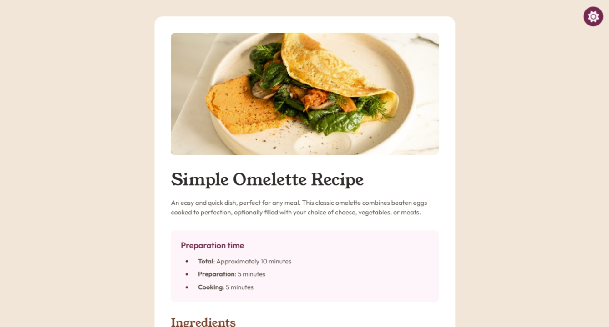

# Recipe Page
This is a solution to the [Recipe Page](https://www.frontendmentor.io/challenges/recipe-page-KiTsR8QQKm) challenge on Frontend Mentor. Frontend Mentor challenges help you improve your coding skills by building realistic projects. 

## Overview
As part of the [Getting started on Frontend Mentor](https://www.frontendmentor.io/learning-paths) learning pathway, it is the last of four challenges users must complete to finish the unit.

### Screenshot

### Modifications
I added Dark Mode to the website. The `alt-mode` folder contains a separate README explaining how it works. The button is located in the top-right corner of the page and scales down slightly when selected.

### Links
- Solution URL: [Frontend Mentor Solution Page](https://www.frontendmentor.io/solutions/recipe-page-Jdvqz8aFNJ)
- Live Site URL: [GitHub Page](https://presidenttree94.github.io/recipe-page/)

## Author
- GitHub Profile: [PresidentTree94](https://github.com/PresidentTree94)
- Frontend Mentor Profile: [PresidentTree94](https://www.frontendmentor.io/profile/PresidentTree94)
- Author Website: [PresidentTree94 Portfolio](https://presidenttree94.github.io/project-portfolio/)
